# Meridian Sequence Diagrams: All Core Scenarios

Last updated: 2026-03-29

This guide visualizes the major runtime flows in Meridian across Frontend, API, AI service, Redis, and PostgreSQL.

## 1. User Authentication (GraphQL)

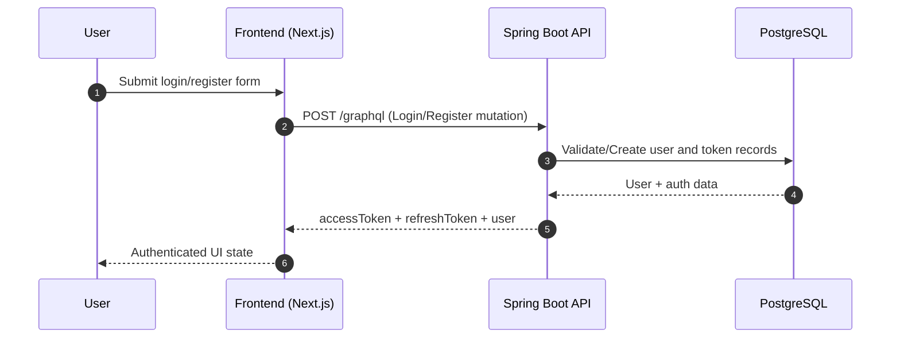

## 2. Token Refresh Flow (GraphQL)

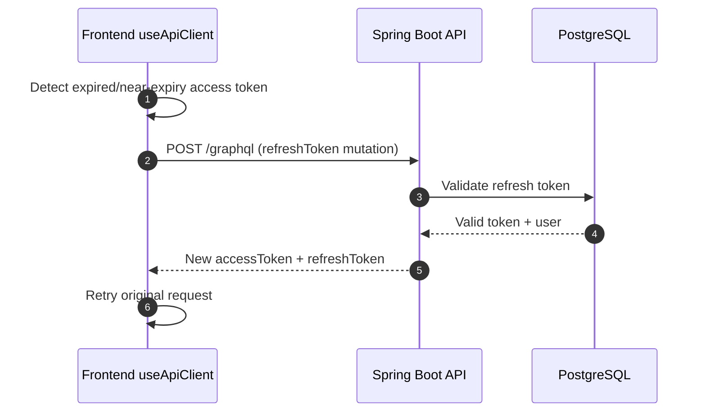

## 3. Project and Dashboard Data (GraphQL)

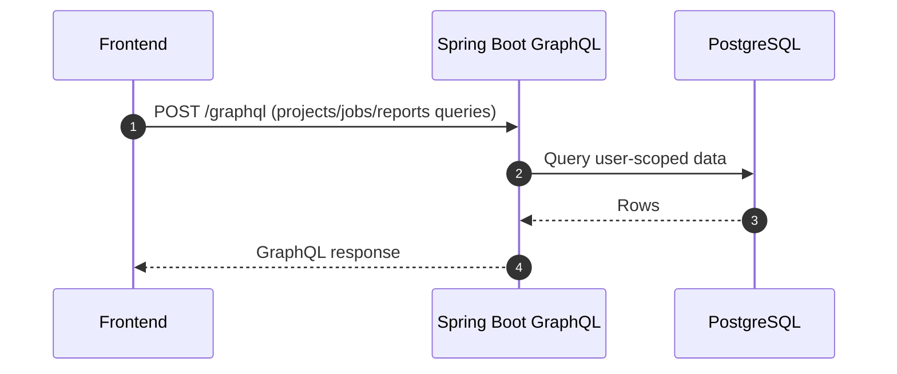

## 4. Document Upload (REST) + Metadata Read (GraphQL)

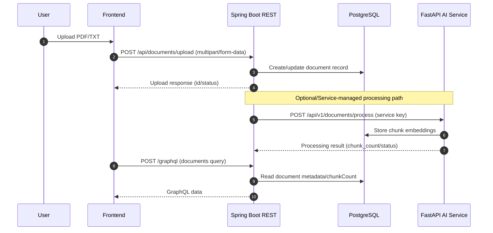

## 5. Research Job Submission and Orchestration

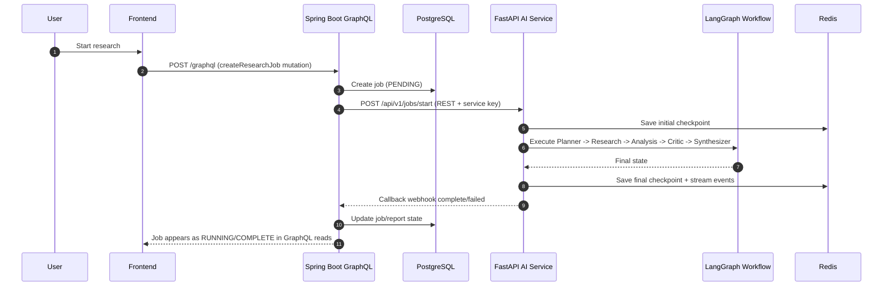

## 6. Live Progress Streaming (SSE Direct FE -> AI)

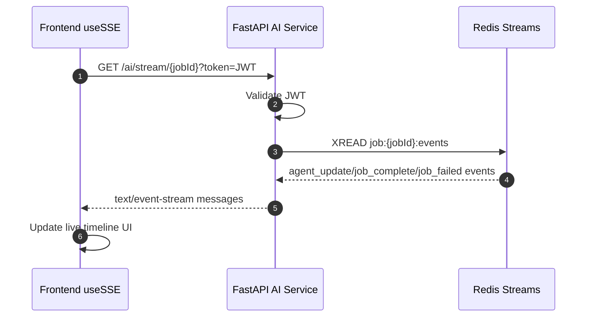

## 7. AI -> API Completion/Failure Webhooks

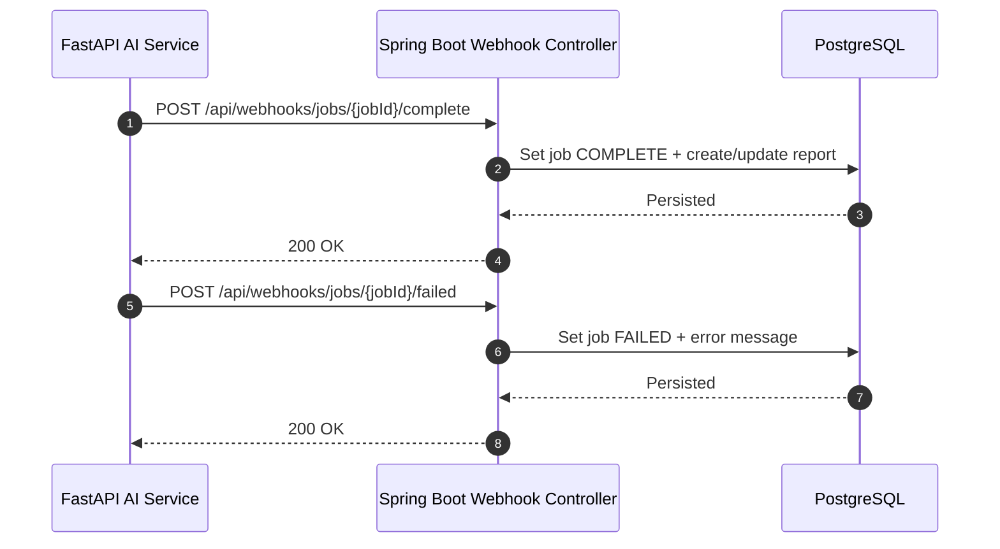

## 8. Job Status Polling (REST API Boundary)

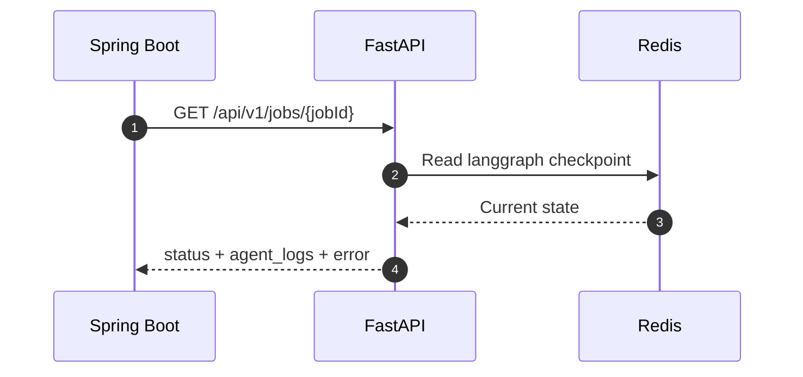

## 9. Chat via GraphQL Proxy (Primary Product Path)

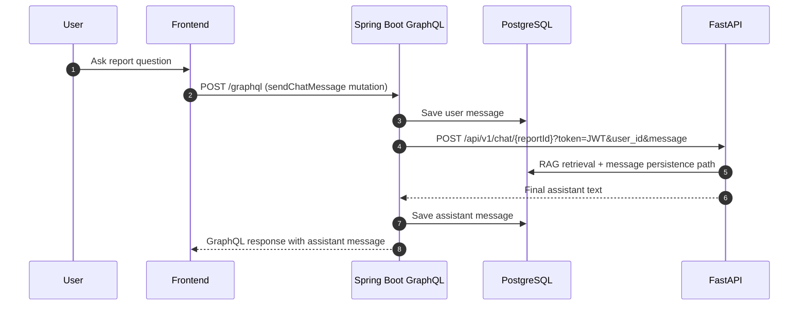

## 10. Direct Frontend -> AI Chat (Possible Architecture Path)

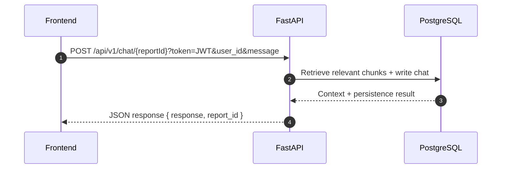

Note:

- This path is technically available, but the main product flow currently uses GraphQL mutation proxy through API for consistent authorization and data ownership checks.

## 11. Error/Fallback Scenario: AI Job Failure

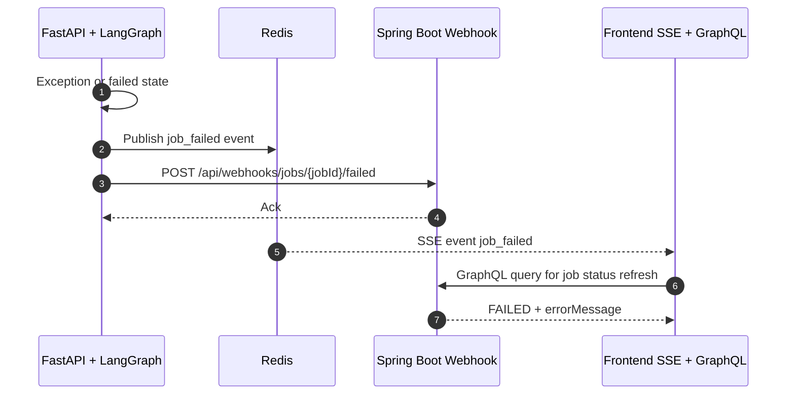

## 12. Communication Pattern Summary

1. Frontend <-> API: Mostly GraphQL, plus REST for file upload.
2. Frontend <-> AI: Direct SSE for live updates, optional direct chat endpoint exists.
3. API <-> AI: REST for job submission/status and report-completion webhooks.
4. AI <-> Redis: Streams for eventing and checkpoints.
5. API/AI <-> PostgreSQL: Primary persistence and retrieval.

## 13. Practical Guidance

1. Keep job creation routed through API -> AI (current design) for stronger governance and consistent authz.
2. Keep SSE direct FE -> AI for low-latency live updates.
3. Keep multipart upload as REST; GraphQL remains ideal for typed business entities.
4. If enabling direct FE -> AI chat broadly, enforce the same authorization and audit guarantees as API proxy path.
